<!-- Internal_Design -->

## Logical View

Following class diagram shows various components which are part of gantry display WPF application.

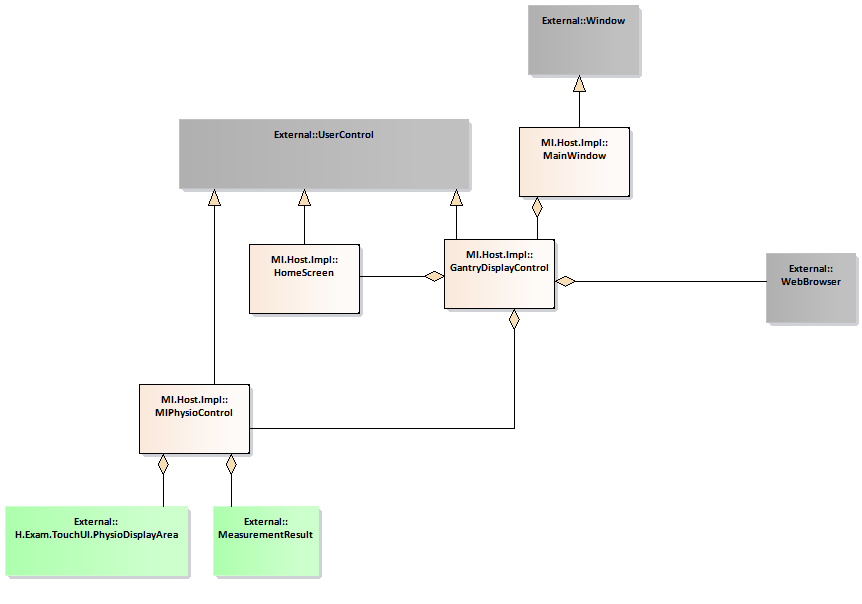{#fig:}

Following class diagram shows various components linkages for toggling pscope header. This class diagram also shows various classes and their associations and compositions to achieve the same.

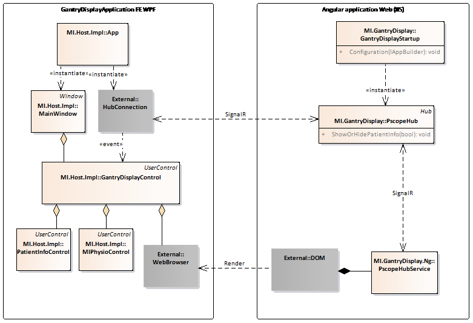{#fig:}

This class diagram describes the whole gantry display application, which includes both front end and back end. This diagram shows various components and communication between them. This includes SignalR communication between angular clients and back end hubs, H communication between gantry display back end and Exam/Calibration/System layer.

Following class diagram also shows, how gantry display angular application is hosted in IIS and how gantry display FE(WPF application) is browsing to the IIS hosted angular app.

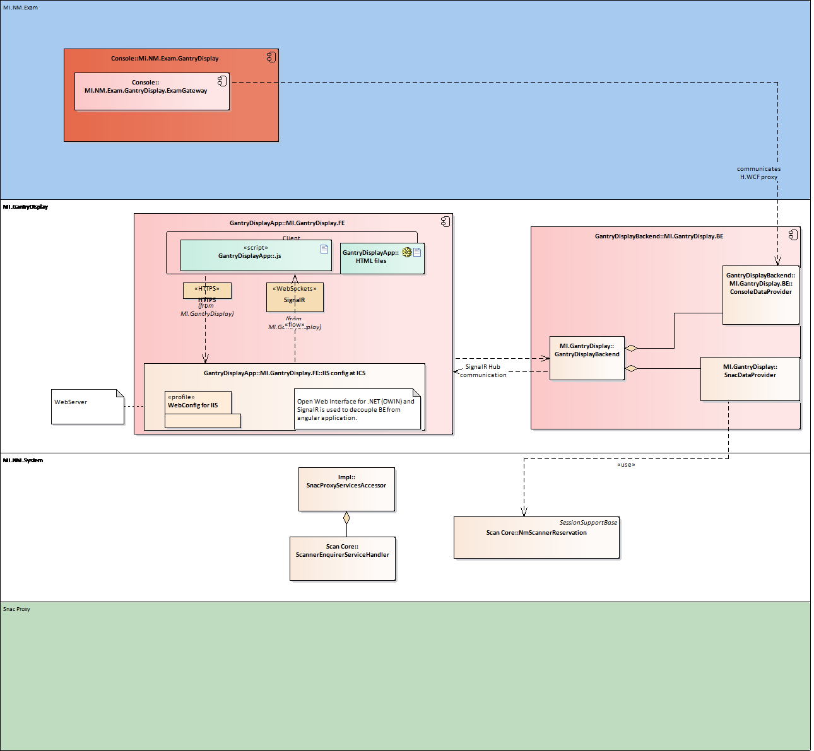{#fig:}

### Calibration

Following class diagram shows the GantryDisplay class structure for Calibration Mode. This Diagram basically shows ExecutionControl related operation but same can be extended to ProtocolParameter, ScanProgress and any other operation between GPT and Calibration App.

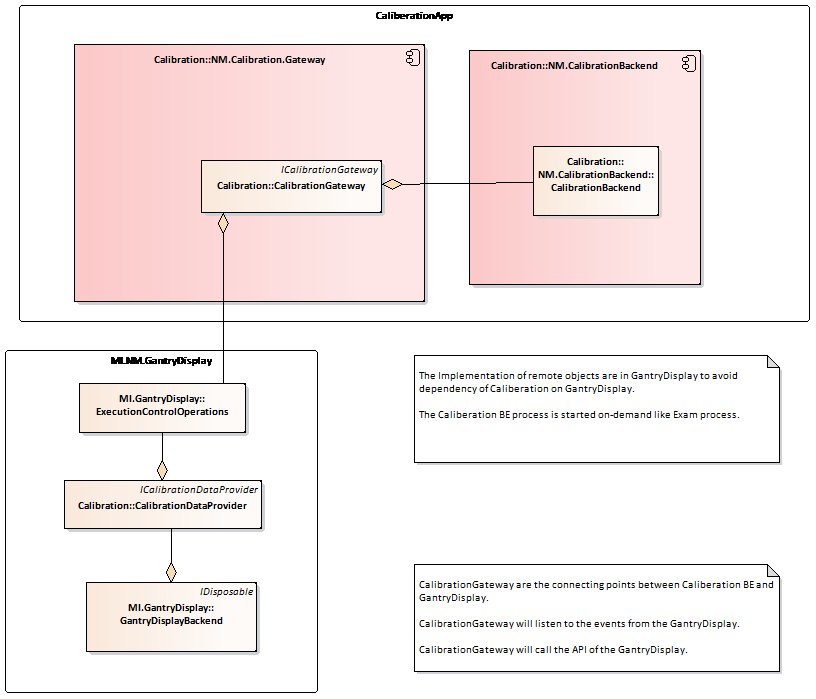{#fig:}

Following class diagram shows the GantryDisplay class structure for Calibration Motion Info Provider. This Diagram basically shows Opening or closing automatic motion in progress and enable/Disable navigator buttons in gantry display from calibration

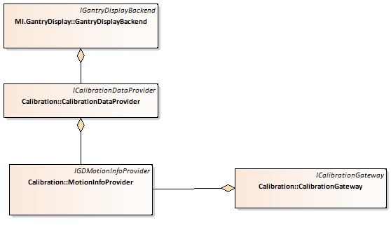{#fig:}

### GantryDisplayDiagnostics

The class diagram to show the relationship between classes and interfaces involved in GPT Asset management and Computer Diagnostics.

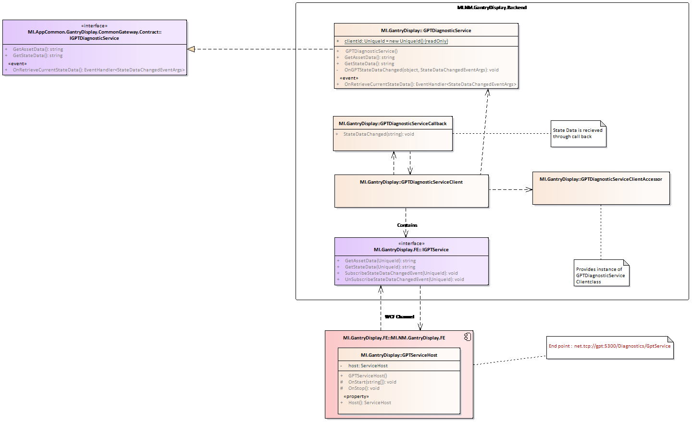{#fig:}

### GantryDisplayPlanning

The class diagram to show the relationship between classes and interfaces involved in IQSpect and Planar planning operation.

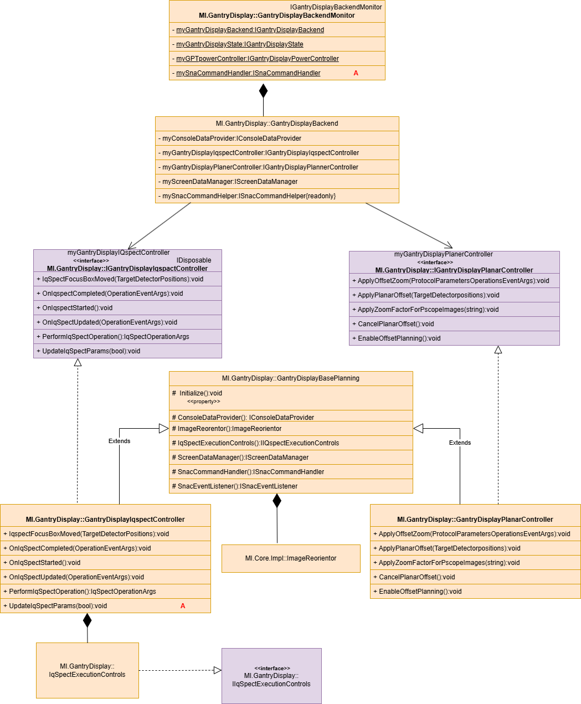{#fig:}

### GantryOperations

The class diagram to describe relationship between classes for change collimator operation in gantry display. User can install required collimators depending on scan to be performed. For example, LEHR collimator while performing planar scans and Smart zoom collimator for IQSpect planning. Collimator has its own set of detector configurations, that need to configured before the scan.

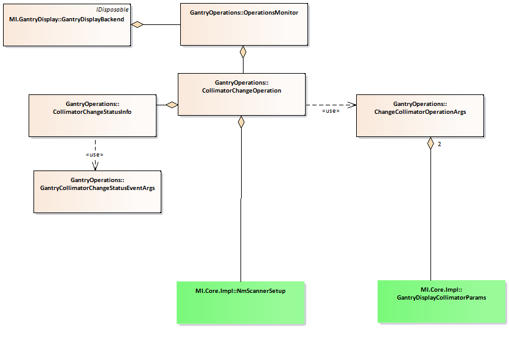{#fig:}

The class diagram to show various gantry operations that user can perform in gantry display. Those operations include collimator change, touch pad test, unload, retract, homing, configure gantry etc. Mainly gantry display back end has IOperationsMonitor and IOperation interfaces to handle various gantry operations.

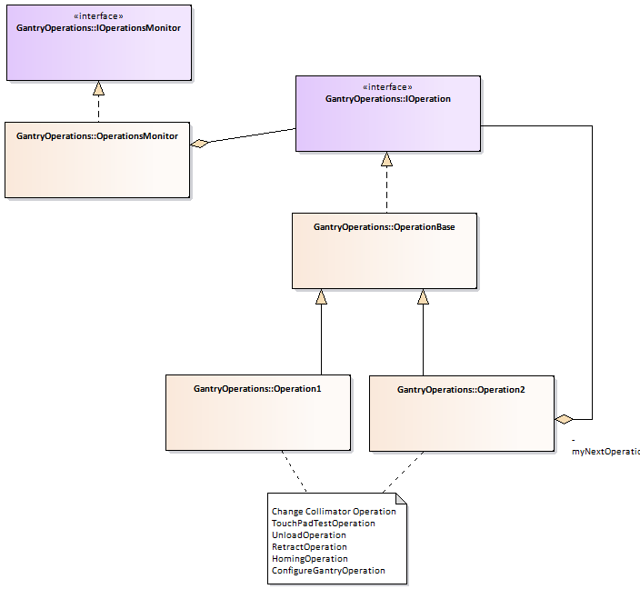{#fig:}

### IQSPECT

The class diagram to show the relationship between classes and interfaces involved in IQSpect operations. Prerequisites to enable IQSpect planning are cardiac IqSpect protocol to be loaded, smart zoom collimator need to be installed and detectors should be in IqSpect configuration. On moving IqSpect planning box to focus on interested area, user can start IQSpect planning. User can do IqSpect move and cancel operations to move detectors to focused area and to cancel or re-center the IQSpect planning respectively.

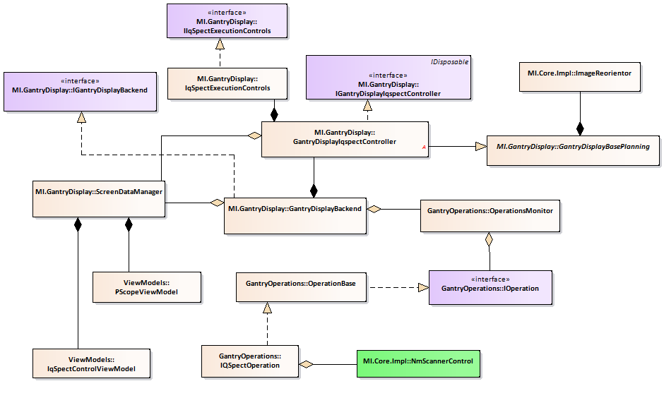{#fig:}

### Planar Offset

The class diagram to show relationship between classes and interfaces for planar offset. For any planar scan protocol, when user changes zoom \> 1.0 in PLV, offset button appears in gantry display. On click of offset button, planar offset button controls like apply, center and cancel are shown in gantry display UI. The planar offset focus box for planning is also shown. User can move the box to desired offset and can apply offset. On center button click, focus box is re-centered. On click of cancel, offset planning is canceled and previously saved offset is retained.

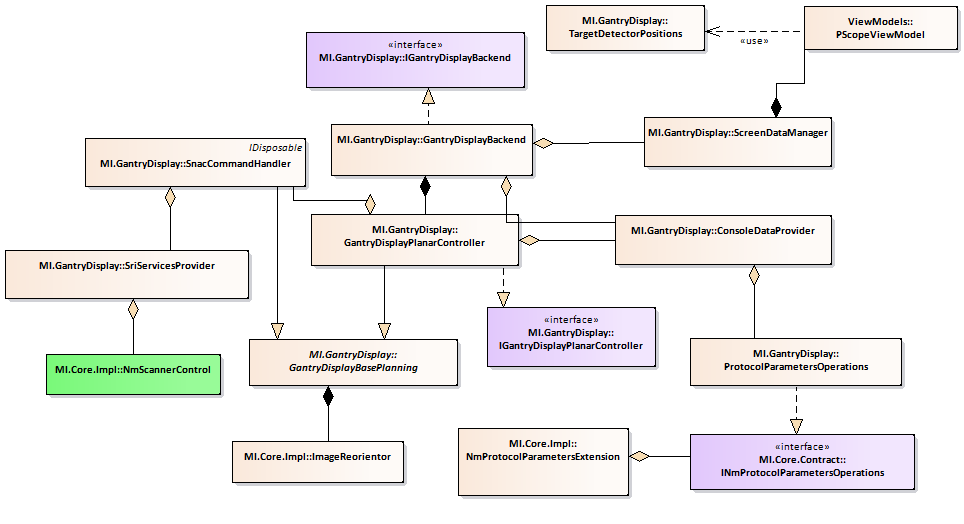{#fig:}

### PowerSave

The class diagram to show power save mode in gantry display. When user has not done any interaction or when system is inactive for 10 minutes, then system interface invokes power save mode. The same is notified to gantry display. As soon as gantry display is notified with power save, system enters into power save mode. User can wake up the system, either by touching gantry display device or by doing any interaction in ICS.

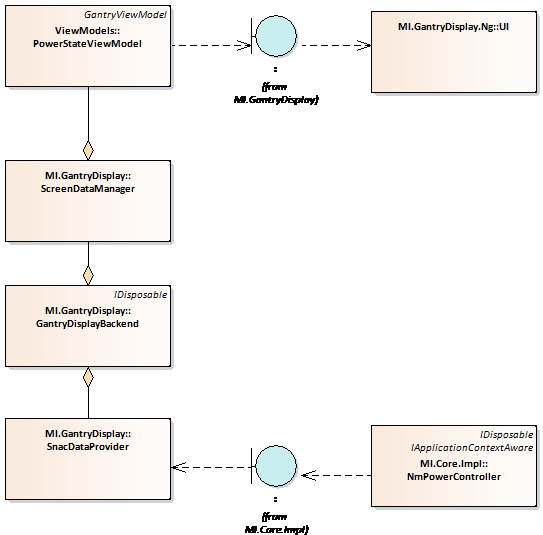{#fig:}

### Recovery

The class diagram to show the relationship between the classes for recovery in gantry display. During collimator change cancel, recovery is invoked. Recovery operation brings the system back to nearest stabilized state.

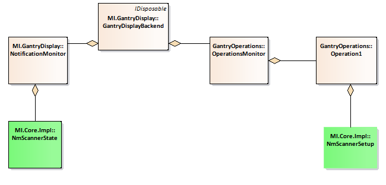{#fig:}

#### MI.GantryDisplay.DataProvider::LocalValueParameter\<T\>

### RemoteLauncher

Following diagram shows how user can open remote gantry display from console menu. It opens gantry display in read only mode if IsVncInReadOnly property is true in vnc configuration.

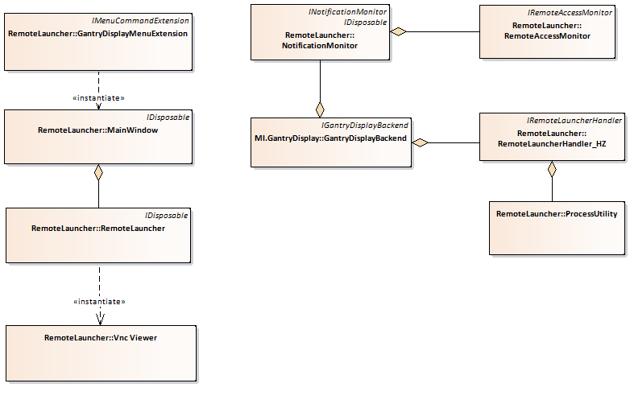{#fig:}

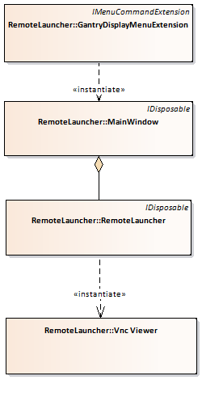{#fig:}

### SystemReconfiguration

The class diagram to show the relationship between classes and interfaces for system reconfiguration in gantry display. Each collimator has its own set of system configuration. It is displayed in system reconfiguration flyout of gantry display UI. User can change to required detector configurations for the collimator installed, to configure detectors before starting the scan.

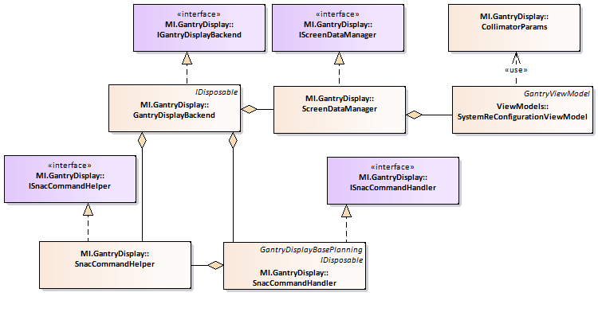{#fig:}

### UnloadPatient

The class diagram to show the relationship between classes and interfaces involved in Unload Dialog Sync between Gantry Display and Exam application.

{#fig:}

### WebConfig for IIS

## Deployment View

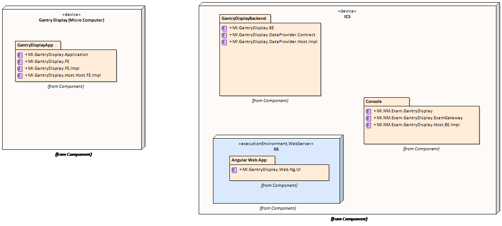{#fig:}

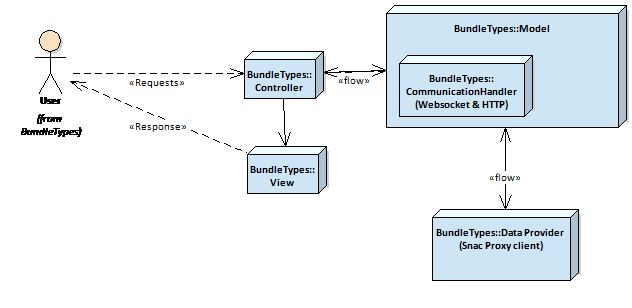{#fig:}

## Dynamic View

Following diagram shows how Home Screen is shown when Gantry Display WPF application comes up. It will set the HomeScreen to "Connecting To UI" when Scanner is not connected and it will browse to angular app when Scanner is connected.

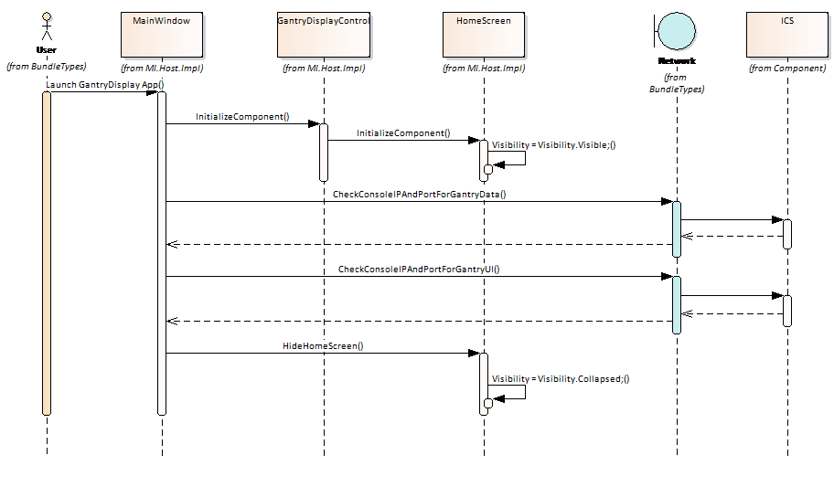{#fig:}

Following sequence diagram shows how Initial screen is displayed when GantryDisplay.FE application comes up.

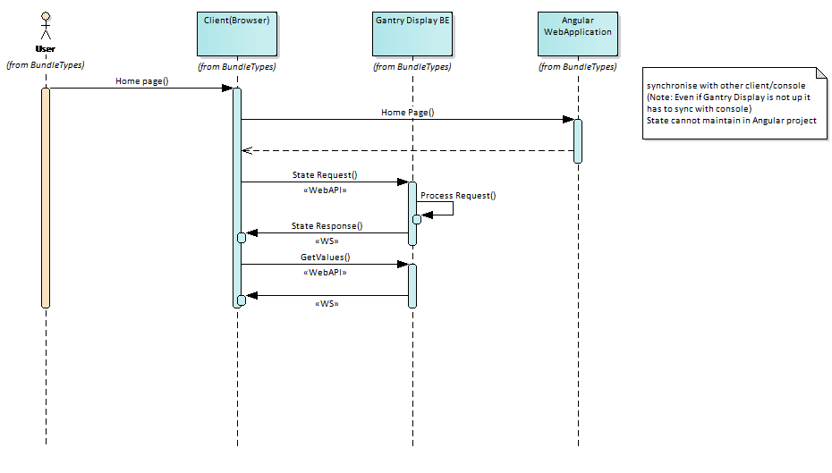{#fig:}

Following sequence diagram shows how the Patient Information is fetched and displayed. The visibility of the patient info is fetched from Config.Net.

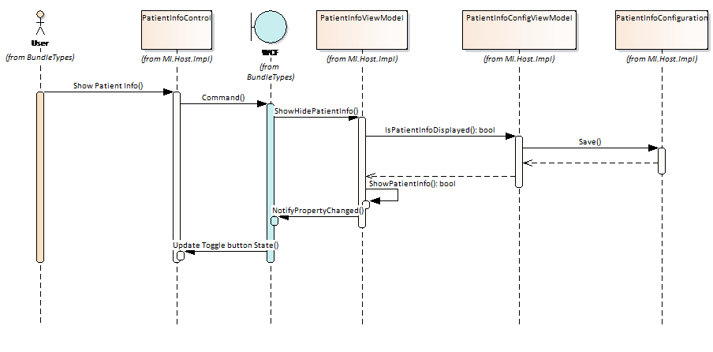{#fig:}

Following sequence diagram shows how Angular client fetches PositionAxes view model from Backend Hub.

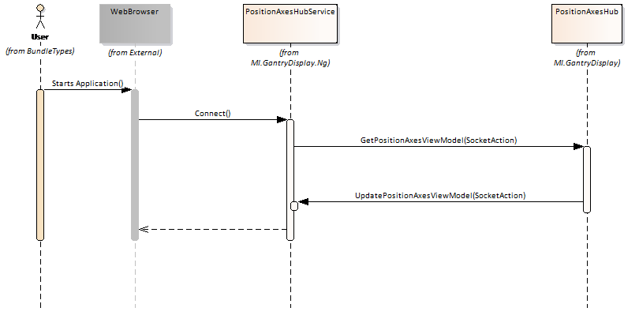{#fig:}

Following sequence diagram shows when Gantry Display comes up then call comes to backend to send latest PScope ViewModel and Navigator ViewModel to Angular clients.

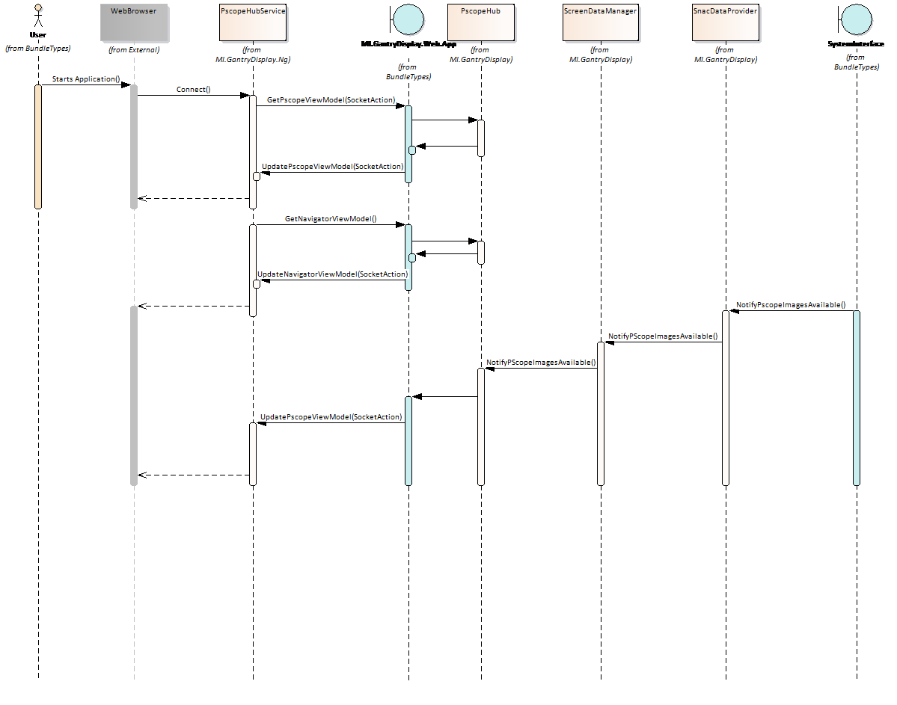{#fig:}

Following sequence shows how we can navigate to a screen when user did some interaction on gantry display

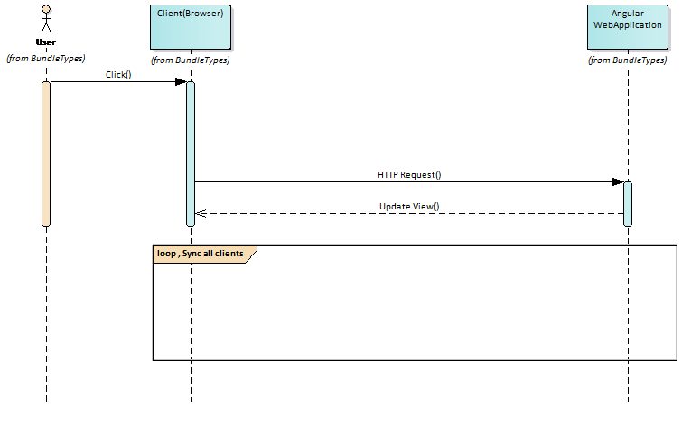{#fig:}

Following sequence diagram shows how we can toggle visibility of header of Pscope page on various user interactions.

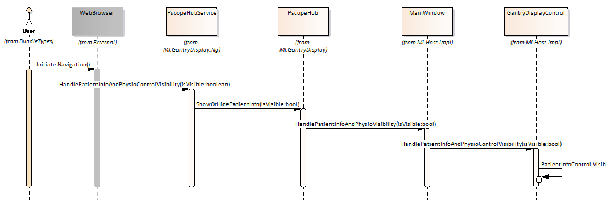{#fig:}

Following diagram shows the sequence of steps which will be performed when stutdown call comes from system interface and how gantry display backend handles that call and sends command to frontend to show pop-up and shutdown gantry display.

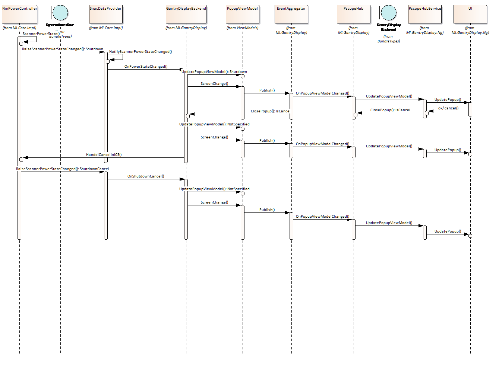{#fig:}

### Calibration

Following sequence diagram shows a sequence to update execution control buttons from CalibrationApp to GantryDisplay and vice versa.

{#fig:}

Following sequence diagram shows object exchange between Gantry Display and Calibration using WCF/H communication.

{#fig:}

Following sequence diagram shows the GantryDisplay sequence structure for Calibration Motion Info Provider. This Diagram basically shows Opening or closing automatic motion in progress and enable/Disable navigator buttons in gantry display from calibration

{#fig:}

#### WCF

### GantryDisplay(Exam Workflow)

{#fig:}

### GantryDisplayDiagnostics

The Sequence diagram to show data flow for Asset Data of GPT Computer Diagram.

{#fig:}

The Sequence diagram to show data flow for StateData of GPT Computer Diagram.

{#fig:}

### GantryOperations

The sequence diagram to show various gantry operations that user can perform in gantry display. Those operations include collimator change, touch pad test, unload, retract, homing, configure gantry etc.

{#fig:}

### IQSPECT

The sequence diagram to show the sequential flow of enabling IqSpect execution controls in the gantry display UI. When IQSpect planning is enabled and planning box appears in the UI, user does IQSpect planning by moving the box. Initially IQSpect execution controls like Move and Cancel are disabled. Once user starts moving planning box, Move button is enabled in the gantry display UI.

{#fig:}

The diagram describes the operational flow of canceling IQSpect move operation, in sequence. IQSpect move operation is cancelable operation. Once user performs move operation, meanwhile user can cancel ongoing detectors move operation. On click of cancel, from gantry display UI, gantry display back end sends cancel command to SNAC to cancel ongoing operation. SNAC either sends gantry setup completed event with canceled status, indicating success or it sends event with error, indicating failure.

{#fig:}

The sequence diagram to show the flow of performing IQSpect move operation. Once user is fine with focused area during IQSpect planning, user clicks IQSpect Move button. IQSpect box position points are sent to SNAC. Detectors are moved focusing planned area. If auto move of detectors is success, SNAC sends success status and updates IQSpect positions. Otherwise it sends gantry setup completed with error.

{#fig:}

{#fig:}

### Planar Offset

Sequence diagram to describe the flow of applying planar offset. Offset planning is enabled for acquisition zoom value \> 1. User moves the focus box to the desired portion. Once user is fine with the focused area, he can apply offset. Gantry display back end sends offset positions to system interface to apply the desired offset.

{#fig:}

Sequence diagram to describe the flow of applying planar offset. Offset planning is enabled for acquisition zoom value \> 1. User moves the focus box to the desired portion. Once user is fine with the focused area, he can apply offset. Gantry display back end sends offset positions to system interface to apply the desired offset.

{#fig:}

Sequence diagram to show the flow of Cancel planar offset. During current planar offset planning, if user doesn't intend to save the offset, he can cancel offset. On cancel offset, previously applied offset is retained. Pscope image is applied with the current acquisition zoom and previously applied offset.

{#fig:}

#### InteractionFragment

### PowerSave

Following diagram shows how the PowerSave/Power WakeUp call comes from System Layer to GantryDisplay BE and sends the same to UI which in turn informs the system to move to corresponding power state.

{#fig:}

### Recovery

Following diagram shows the sequence of operations performed when recovery operation is started.

{#fig:}

### RemoteLauncher

Following diagram shows how user can open remote gantry display from console menu. It opens gantry display in read only mode if IsVncInReadOnly property is true in vnc configuration.

{#fig:}

Following diagram shows how user can open remote gantry display from console menu. It opens gantry display in read only mode if IsVncInReadOnly property is true in vnc configuration.

{#fig:}

### SystemReconfiguration

Following diagram shows the sequence of steps performed when Collimator change or change Detector configuration operation is initiated by user. It also shows various events like OnGantrySetupCompleted, GantrySetupStarted etc. which will be handled during this operation.

{#fig:}

#### WebServer

### UnloadPatient

The diagram describes the operational flow of how Unload Dialog Sync happens between Gantry Display and Exam application when user clicks on Unload button on Gantry Display UI, in sequence.

{#fig:}

## Algorithms

## Data View

## Code View

# Testing 

